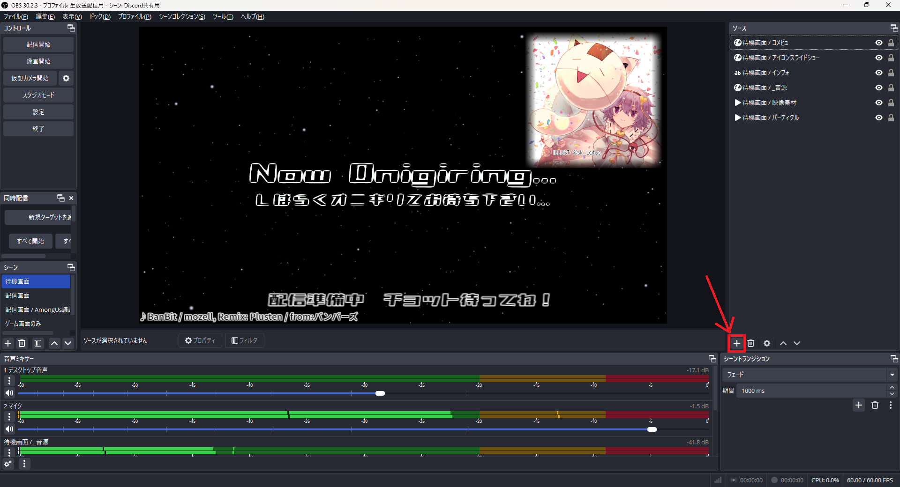
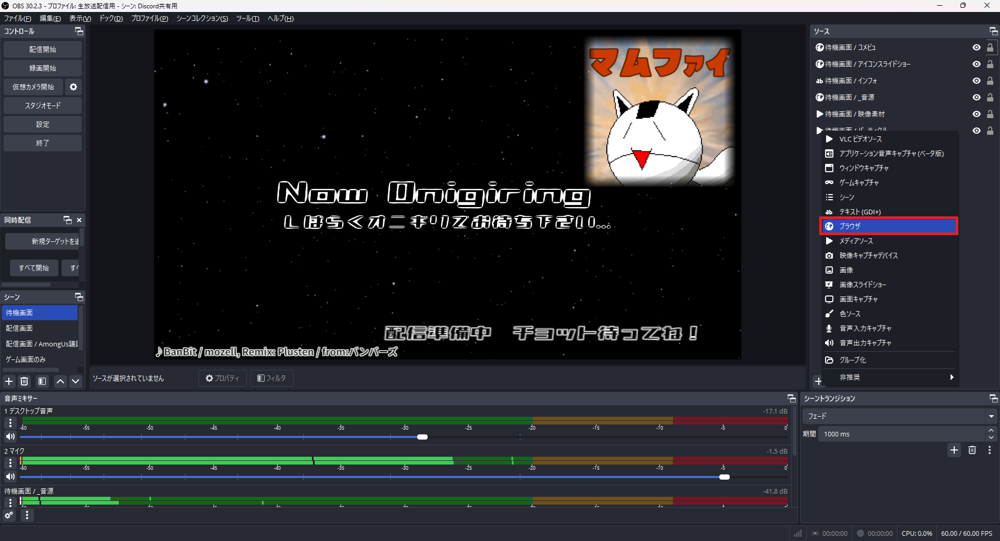

# 配信用 音源ランダム再生＆楽曲名表記システム

## What is this / このツールについて

このツールは、[OBS Studio](https://obsproject.com/)で配信を行う際に雑談配信などで BGM をランダムに再生し、現在再生中の楽曲名を表示するために作成しました。

通常、OBS では 1 曲をループ再生するしかありませんが、さまざまな曲をランダムに流したいというニーズに応えるものです。

## How to use / 使い方

1. ZIP ファイルをダウンロードして解凍します。
2. 再生したい音源ファイルを`music`フォルダに入れます。
3. `musicList.js`をテキストエディタで開き、再生したい音源ファイル名および楽曲情報を記入します。
4. OBS のソースからブラウザを選択し、`index.html`ファイルを表示します。

以上です！シンプルで扱いやすい使い方を目指しました。

また、`ending.html`などファイル名を変更して読み込むと、そのファイルに応じたプレイリストを別途再生できます。  
変わった使い方だと、サーバー上にアップロードして URL パラメータ`scene`を指定することでも、プレイリストの変更が可能です。

サンプルページは以下を確認して下さい。  
※サンプルページを別タブで開くと、ブラウザのセキュリティ上の都合で音源が再生されない仕様になっています。

-   [index.html](https://mfv2.github.io/LiveStreamAudioRandomizer/)
-   [index.html?scene=ending](https://mfv2.github.io/LiveStreamAudioRandomizer/?scene=ending)
-   [ending.html?scene=ending](https://mfv2.github.io/LiveStreamAudioRandomizer/ending.html)

OBS への取り込み手順は以下の画像を参考にしてください。

  
  

## System requirements / 動作環境

OBS Studio version 30.2.3 での動作を確認しています。

## Credit / クレジット

サンプルの作成にあたり、以下の楽曲を使用しました。

-   ElecTrain / [LSD_sc](https://soundcloud.com/lsd_sc)
-   春の教室 / [OtoLogic](https://otologic.jp/) (CC BY 4.0)
-   もりのふしぎ / [こんとどぅふぇ HiLi](https://conte-de-fees.com/)
-   紅茶の時間 / [甘茶の音楽工房](https://amachamusic.chagasi.com/)
-   深夜放浪 / [巣鴨放送局](https://www.youtube.com/@SugamoBroadcaster)

音源ファイルの使用にあたり利用規約は確認しましたが、問題がございましたら MFV2 までご連絡ください。

## License / ライセンス

このソースコードは MIT ライセンスに準じます。  
ただし、`music`フォルダ内の音源ファイルは各作曲者に著作権があるため、MIT ライセンスの対象外です。(あたりまえ体操)

また、ソースコードのそのままの再配布は可能な限りお控えください。何かしら改変を加えた上での公開だと嬉しいです。どうしてもそのまま再配布する場合は、見えない範囲で行ってください。

## Other / その他

ソースコードの使用にあたり著作表記とかもいらないのでドンドン使用してください。使ったよ～的な報告があればニヤニヤしながら放送を眺めに行きます。

バグ報告、何か追加して欲しい機能等あれば MFV2 までどうぞ。気力とやる気があれば可能な限り対応します。
